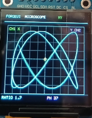
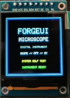
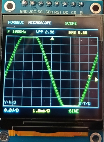
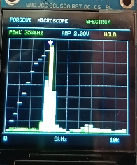

# ForgeUI MicroScope — ESP32-S3 + ST7789 240×240

ForgeUI MicroScope V1 is a physically tested miniature instrumentation and graphics showcase for an ESP32-S3 DevKitC-1, a 1.54-inch ST7789 square SPI TFT at its native 240×240 resolution, and an analogue joystick with push switch. It builds on the physically proven ForgeUI ST7789 240×240 square-display baseline.



## Important: V1 uses simulated signals

**MicroScope V1 does not sample an external analogue input. Its waveform, measurements, spectrum data, and XY signals are internally generated/simulated.** It is a graphics and instrumentation showcase, not a real oscilloscope measurement instrument.

## Physical graphics pass

MicroScope has been physically run on the stated ESP32-S3 and ST7789 hardware. Current daylight photography physically demonstrates MicroScope startup/self-test, SCOPE rendering, SPECTRUM rendering, and XY/Lissajous rendering.

- Firmware build and flash: PASS
- ST7789 initialisation and full 240×240 rendering: PASS
- Joystick input: operational
- ForgeUI MicroScope graphics, graticule, animated traces, and instrumentation readouts: physically rendered



## Instrument modes

The joystick button cycles `SCOPE → SPECTRUM → XY → SCOPE`. The firmware provides a ForgeUI instrument header and mode-specific readouts/footer in each mode.

### SCOPE

SCOPE renders an internally generated sine, square, triangle, or noisy waveform. It includes an animated trace, oscilloscope-style graticule, trigger-level marker, trigger-position marker, volts/div, time/div, frequency, Vpp, RMS, and a dim persistence/glow companion trace.

The frequency, Vpp, and RMS values correspond to the simulated/generated source; they are not measurements of an external signal.



### SPECTRUM

SPECTRUM is a **simulated/generated spectrum visualisation**, not an FFT. It renders 32 generated spectrum bins with simulated harmonic content, an animated noise floor, peak-hold markers, and a dominant-bin cursor. Its peak-frequency and amplitude readouts correspond to the generated source.



### XY / Lissajous

XY renders a source-verified animated XY/Lissajous-style trace with a graticule, centre reference, phase readout, and ratio readout. The hero photograph above provides daylight physical evidence of XY/Lissajous mode on the tested hardware.

## Controls

| Mode | Joystick X | Joystick Y | Button |
| --- | --- | --- | --- |
| Any | Mode-specific control | Mode-specific control | Normal release cycles `SCOPE → SPECTRUM → XY → SCOPE` |
| SCOPE | Time/div | Volts/div | Hold for ≥700 ms, then release, to change generated waveform |
| SPECTRUM | Generated source frequency | Generated source amplitude | Normal release changes mode |
| XY | Phase | Frequency ratio | Normal release changes mode |

## Verified common features

- ForgeUI MicroScope startup/self-test
- 64-sample joystick-centre calibration
- 180-unit joystick dead zone
- Full-resolution 240×240 `Arduino_Canvas`
- Approximately 30 FPS target loop
- Mode switching and mode-specific readouts

## Hardware

- Board: ESP32-S3 DevKitC-1
- Display: 1.54-inch square ST7789 SPI TFT
- Native resolution: 240×240
- PCB marking: `1.54TFT-SPI-ST7789 Ver:1.1`
- Input: analogue joystick with push switch

### Display and joystick wiring

| ST7789 | ESP32-S3 |
| --- | --- |
| GND | GND |
| VCC | 3.3V |
| SCL / SCLK | GPIO12 |
| SDA / MOSI | GPIO11 |
| RES / RST | GPIO10 |
| DC | GPIO9 |
| CS | GPIO8 |
| BLK | 3.3V |

MISO is unused. **BLK → 3.3V is physically proven for this specific module only; do not generalise that connection to every ST7789 module.**

| Joystick | ESP32-S3 |
| --- | --- |
| SW | GPIO4 |
| VRy | GPIO5 |
| VRx | GPIO6 |
| +5V-labelled supply | 3.3V |
| GND | GND |

GPIO7 remains spare.

## Proven display configuration

The firmware uses Arduino_GFX with ESP32 HSPI, CS on GPIO8, and an ST7789 configured for a 240×240 viewport. Rendering uses a full-resolution `Arduino_Canvas` before each display flush.

## Software and build baseline

- PlatformIO
- `espressif32@6.7.0`
- `esp32-s3-devkitc-1`
- Arduino framework
- Arduino_GFX `1.3.7`

Arduino_GFX is deliberately pinned to 1.3.7 because a newer unpinned version produced an `esp32-hal-periman.h` compatibility failure in this environment. The pinned dependency can emit internal `SPI_MAX_PIXELS_AT_ONCE` redefinition warnings while the build still succeeds.

```sh
pio run
pio run --target upload
pio device monitor
```

## Physical validation record

| Image | Use |
| --- | --- |
| [splash0-st7789-240x240.png](splash0-st7789-240x240.png) | Daylight physical startup/self-test evidence |
| [splash2-st7789-240x240.png](splash2-st7789-240x240.png) | Daylight physical SCOPE-mode evidence |
| [splash6-st7789-240x240.png](splash6-st7789-240x240.png) | Daylight physical generated-SPECTRUM evidence |
| [splash10-st7789-240x240.png](splash10-st7789-240x240.png) | Daylight physical XY/Lissajous-mode evidence and README hero |
| [splash-st7789-240x240-square.png](splash-st7789-240x240-square.png) | Supporting golden ST7789 display bring-up evidence only; not MicroScope evidence |

## Golden hardware reference and ForgeUI

[forgeui-hw-st7789-240x240-square](https://github.com/RTechAI/forgeui-hw-st7789-240x240-square) is the golden ForgeUI hardware reference for this physically proven square-display configuration. MicroScope is an application/showcase built on that baseline.

This project is part of the [ForgeUI](https://forgeui.co.nz) Hardware Lab. [ForgeUI Studio](https://studio.forgeui.co.nz) provides the broader ForgeUI interface-design context.

## Attribution and license

[Arduino_GFX](https://github.com/moononournation/Arduino_GFX) is an independently owned and licensed external dependency; it retains its own copyright and licence.

The independent [kursatEcinni/esp32s3-st7789-test](https://github.com/kursatEcinni/esp32s3-st7789-test) repository was reference material during the initial ST7789 investigation. ForgeUI does not own that project.

ForgeUI-authored repository content is released under the [MIT License](LICENSE). Third-party software remains subject to its respective licences.

## Future work

A future version may investigate a safe external ADC-input direction. That work is not implemented in MicroScope V1.

## Known future wording correction

The physically proven runtime startup screen currently says `SCOPE // FFT // XY`. This is only a wording issue: the current SPECTRUM mode is generated/simulated and is not an FFT. A future runtime change should replace that text with `SCOPE // SPECTRUM // XY`.
